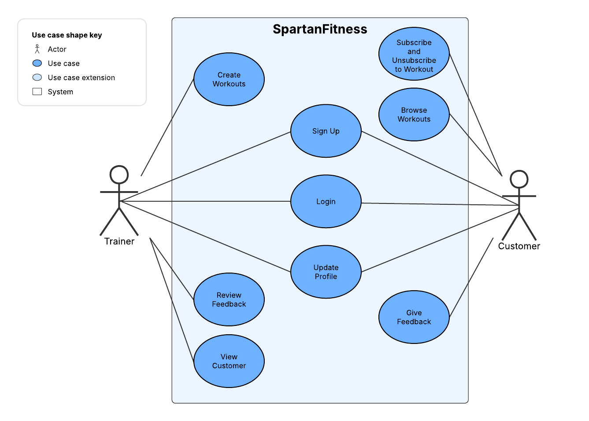
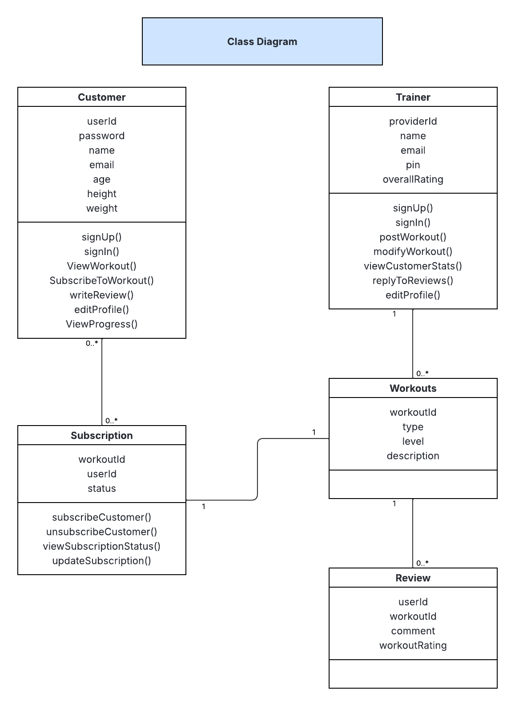
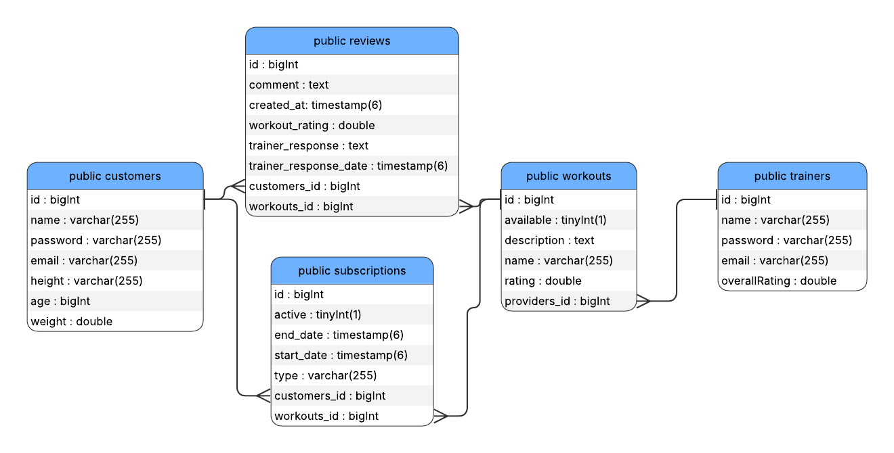

Table of Contents
=================
* [Revision History](#revision-history)
* 1 [Product Overview](#1-product-overview)
* 2 [Use Cases](#2-use-cases)
  * 2.1 [Use Case Model](#21-use-case-model)
  * 2.2 [Use Case Descriptions](#22-use-case-descriptions)
    * 2.2.1 [Actor: Farmer](#221-actor-farmer)
    * 2.2.2 [Actor: Customer](#222-actor-customer) 
* 3 [UML Class Diagram](#3-uml-class-diagram)
* 4 [Database Schema](#4-database-schema)

## Revision History
| Name | Date    | Reason For Changes  | Version   |
| ---- | ------- | ------------------- | --------- |
|  Al  |10/8     | Initial Design      |    1      |
|  MB  |10/16    | Initial Design      |    1      |
|  ER  |10/16    | Initial Design      |    1      |

## 1. Product Overview
SpartanFitness is web-based platform designed to help individuals of all fitness levels access structured training programs, workout resources, and progress tracking tools. Users can explore customized exercise routines, monitors their performance over time, and engage with a supportive community to stay motivated. Trainers can create and share personalized workout plans, track client achievements, and provide feedback directly through the system. The platform supports multiple user roles, including members, trainers, and administrators, each tailored tools to ensure an engaging effective, and goal-oritented fitness experience.

## 2. Use Cases
### 2.1 Use Case Model

### 2.2 Use Case Descriptions

#### 2.2.1 Actor: Provider
##### 2.2.1.1 Sign Up
A provider can sign up to create their profile with their name, email, password, and phone number. Emails must be unique.
##### 2.2.1.2 Log In
A provider shall be able to sign in using their registred email and password. After logging in, the provider shall be directed their dashboard where they see an overview of their homepage, workouts and stats.
##### 2.2.1.3 Update Profile
A provider shall be to modify their profile by going to their profile page. They can change their email, password, and workout plans.
##### 2.2.1.4 Create workout plans
The provider shall be able to create a new workout plans. They would provide a workout names, and description. This workouts can be unique to each provider. 
##### 2.2.1.4 View Customer Stats
A provider will be able to view several statistics such the total amount of subscribers, average ratings, and the overall progress of their customers. 

#### 2.2.2 Actor: Customer
##### 2.2.2.1 Sign Up
A customer can sign up to create their profile with their name, email, password, and address. Emails must be unique.
##### 2.2.2.2 Log In
A customer shall be able to sign in using their registred email and password. After logging in, the customer shall be directed their dashboard where they see an overview of their subscriptions.
##### 2.2.2.3 Browse Workouts
A customer shall be able to view available workout plans. They can do this from the workouts page or using a search function. They can also filter workouts by name, type, or trainer. They will also be able to select one workout and view more details.
##### 2.2.1.4 Subscribe to Workouts
Upon selecting a workout, a customer shall be able to subscribe for the workout using a one-click action. This workout will then appear on their dashboard, and they will be able to ammend the subscription.
##### 2.2.1.5 Review Workouts
A customer may write a review for a workout plan they subscribed to. They will be able to rate the workout with a out of 5 points system.

## 3. UML Class Diagram

## 4. Database Schema
